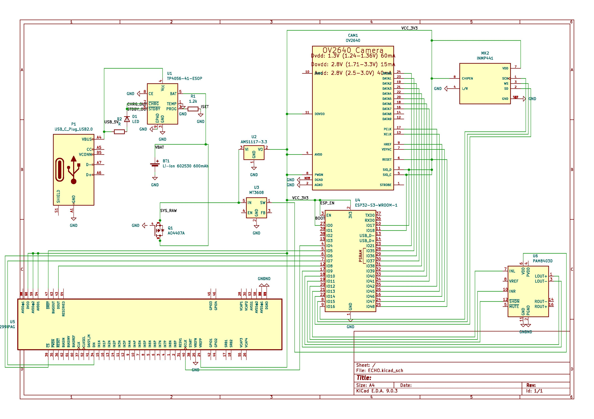

# <b> ECHO: AI-Powered Memory Assistant for Alzheimer’s Patients</b>

## Overview
ECHO is a modular, privacy-first memory assistant built on the Internet Computer Protocol (ICP). It helps Alzheimer’s patients with context-aware cues and supports caregivers with real-time alerts and memory anchoring.

## Team Overview 
 #### Frontend  :- [Archana15-codes](https://github.com/archana15-codes)<br/>
 #### Backend :- [Kartik1446](https://github.com/kartik1446), [Satyabrat2005](https://github.com/satyabrat2005)<br/>
 #### IOT :- [GitGudScrubss](https://github.com/GitGudScrubss)<br/>

## Website Overview


## Backend Overview

# Text emotion detection


# Voice to text emotion detection


# Emotion Detection Stats


## ✅ Features

| Feature                          | Description |
|----------------------------------|-------------|
| 🧠 Smart Memory Queries           | Answers patient questions using pre-set or AI-generated responses |
| 🔐 On-chain Actor Logic (Motoko) | Secure, tamper-proof memory logic stored on ICP |
| 👩‍⚕ Caregiver Anchoring          | Caregivers can set names, identities, or routine facts for recall |
| 🧪 Emotion Detection (Optional)   | Detects vocal stress using Whisper or pyAudioAnalysis |
| 🧩 Dspy-AI Reasoning (Optional)   | LLM agent generates calming, empathetic, dynamic replies |
| 📲 Real-time Caregiver Alerts     | Notifies family in critical behavior (e.g., wandering or distress) |
| 🌐 agent-js Frontend              | Lightweight HTML/JS interface that talks to ICP canister |
| 🔗 Inter-Canister Communication   | Future support for caregiver ↔ patient sync architecture |
| 📊 Logging & Analytics            | Optional logging of queries for pattern review and analytics |
| 🛠 Modular Design                 | Easy to extend with face recognition, TTS, IoT, and more |

---

## 🧱 Architecture Overview

```plaintext
[Patient Device / Web Interface]
        ↓
  [agent-js → ICP Canister]
        ↓
[MemoryAssistant.mo (Motoko)]
        ↓     ↑
 [ML API (FastAPI + Whisper)]
        ↓
[Empathetic Reply / Alert / Log]
```
## Project Structure
### Tech Stack

| Layer             | Technology                               | Role / Purpose                                                                 |
|------------------|-------------------------------------------|--------------------------------------------------------------------------------|
|  Frontend       | HTML, CSS, JavaScript (agent-js)          | Patient-facing UI and communication with the ICP canister                     |
|  Smart Contracts | Motoko (on Internet Computer)             | On-chain logic for memory queries, caregiver updates, and patient data        |
|  SDK / Bridge    | agent-js (DFINITY JavaScript SDK)         | Enables frontend to securely communicate with the ICP backend (canister)      |
|  Dev Tools       | DFX CLI, ICP Local Replica                | Tooling to develop, test, deploy Motoko canisters on local/test/main network  |
|  ML/AI Layer     | Python, FastAPI, Whisper, pyAudioAnalysis | Emotion detection from voice or text inputs; optional behavior inference       |
|  LLM Agent       | Dspy.ai                                   | Generates adaptive, empathetic responses using language models (LLM agent)     |
|  Hosting         | Replit, Render, or ICP Mainnet            | Hosts frontend, ML API, and canisters for demo or production environments      |

## Research paper ( to be uploaded)

## Setup & Deployment

### Prerequisites
- DFX SDK (for Motoko/ICP)
- Node.js (for frontend/agent-js)
- Python 3.8+ (for backend-ml, optional)

### 1. Clone & Install
```sh
git clone <repo-url>
cd echo_memory_assistant
```

### 2. Start ICP Local Replica
```sh
dfx start --background
```

### 3. Deploy Canisters
```sh
./deploy.sh
```

### 4. Run Frontend
Open `frontend/index.html` in your browser.

### 5. (Optional) Start ML Backend
```sh
cd backend-ml
pip install -r requirements.txt
uvicorn app:app --reload
```

## Frontend Canister Integration

To connect the frontend to the Motoko canister locally:
1. Run:
   ```sh
   dfx generate memory_assistant
   ```
2. Copy the generated JS file (e.g., `.dfx/local/canisters/memory_assistant/memory_assistant.js`)
   into the `frontend/` directory or serve it via a local server.
3. Add the following script tag to `index.html` **before** `memory_assistant.js`:
   ```html
   <script src="memory_assistant.js"></script>
   <script src="./memory_assistant.js"></script>
   ```
4. Now the frontend can call the canister methods directly.

## Usage
- Enter queries like "Who is this?" or "Where am I?" in the frontend.
- Caregivers can set memory anchors (future feature).
- Emotion detection and alerts are stubbed for demo.

## Extending
- Add new Motoko canisters for caregiver sync.
- Integrate real ML models in `backend-ml/`.
- Expand frontend for voice, TTS, or IoT integration.

---
## Hardware Documentation




## Hardware connection


## Hardware Overview


## 🖥️ Core Components

| Component        | Description                                    |
|------------------|------------------------------------------------|
| **ESP32-S3-WROOM** (U4) | Dual-core MCU with USB OTG, AI acceleration, and camera interface |
| **OV2640** (CAM1)       | 2MP camera module for capturing images and video |
| **PAM8403** (U6)         | Stereo audio amplifier for driving speakers |
| **TP4056** (U1)          | Li-Ion battery charger with status indicators |
| **AMS1117-3.3** (U2)     | Linear voltage regulator to supply 3.3V |
| **MT3608** (U3)          | Boost converter (optional power conditioning) |
| **AO4407A** (Q1)         | P-Channel MOSFET used as a load switch |
| **Li-Ion Battery** (BT1) | 3.7V 600mAh rechargeable battery |

---

## ⚙️ Working Principle

1. **Power Input**
   - The system can be powered via USB-C (VBUS) or from a Li-Ion battery (BT1).
   - The **TP4056** charges the battery and powers the system when USB is connected.
   - The **AO4407A MOSFET** acts as a switch to allow battery power when USB is disconnected.

2. **Voltage Regulation**
   - **AMS1117-3.3** converts the battery voltage (~3.7V) to **3.3V** to power the ESP32, camera, and other peripherals.

3. **ESP32-S3 Controller**
   - Acts as the brain of the system, communicating with:
     - **Camera Module (OV2640)** via DVP interface (DATA[0–7], PCLK, XCLK, HREF, VSYNC).
     - **Audio Amplifier (PAM8403)** for audio output.
     - USB interface (for programming/data transfer).

4. **Camera**
   - The OV2640 connects directly to the ESP32-S3 using a parallel 8-bit interface with control signals.
   - Powered by 3.3V and has separate analog (AVDD), digital (DVDD), and I/O power domains.

5. **Audio Amplifier**
   - **PAM8403** amplifies stereo output signals (LOUT, ROUT) for speaker playback.
   - Controlled via SHDN and MUTE pins.

---

## 📌 Features

- ✅ Compact and power-efficient design
- ✅ Built-in USB charging via TP4056
- ✅ Battery-operated with automatic switching
- ✅ ESP32-S3 support for AI, image processing, and ML
- ✅ Integrated camera and speaker support

---

## 🔋 Power Budget (Estimates)

| Module       | Voltage | Current (approx.) |
|--------------|---------|------------------|
| ESP32-S3     | 3.3V    | 120–240 mA       |
| OV2640       | 3.3V    | 60–100 mA        |
| PAM8403      | 5V      | 100–200 mA       |
| Total Peak   | —       | ~500 mA          |

---

## 📜 License

This project is open-source and licensed under the [MIT License](LICENSE). You are free to use, modify, and distribute with attribution.
